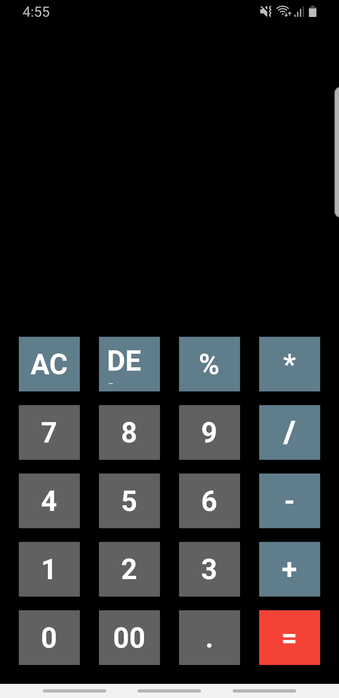
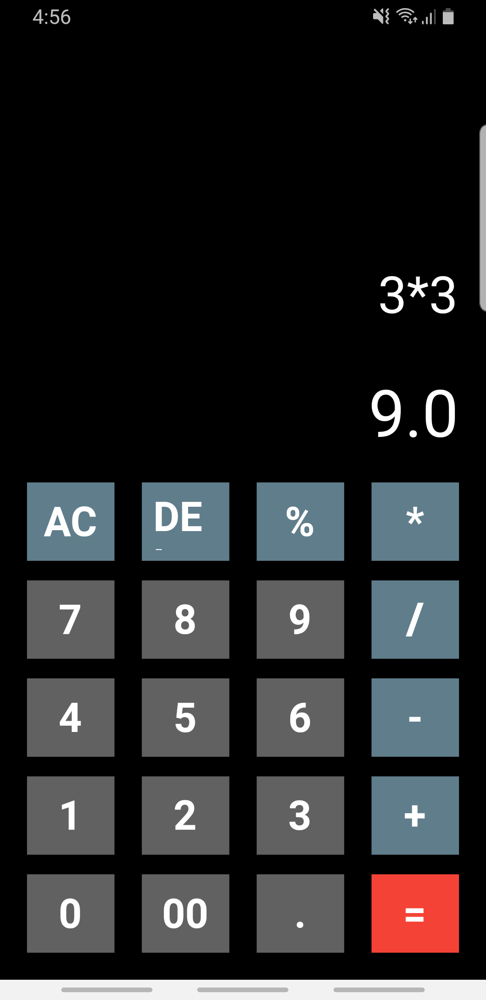

# noon_clone

This was my first application. It makes simple calculations.

- Packages:
    - math_expressions

## Screenshots

https://user-images.githubusercontent.com/81096412/139444348-35a46147-030c-4429-a8d5-2128fce68e54.mp4

## Screenshots

<table>
  <tr>
    <td></td>
    <td></td>
  </tr>
 </table>

